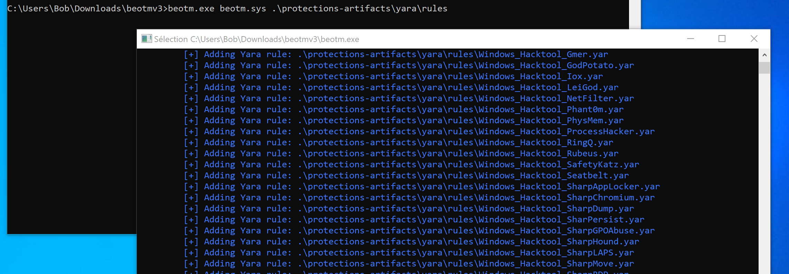
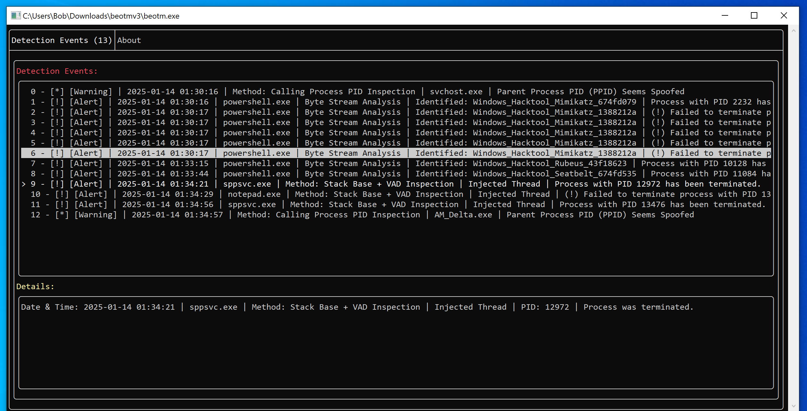

<h2>Defensive Capabilities</h2>

BEOTTOM (Best EDR Of The Total Online Market) is a fork of Xacone's BEOTM v3 focused on defensive telemetry and detection engineering in a Windows lab environment.

Core defensive capabilities include:

- [x] <a href="https://xacone.github.io/BestEdrOfTheMarketV3.html#4">System Calls Interception via Alternative System Call Handlers</a>
- [x] <a href="https://xacone.github.io/BestEdrOfTheMarketV3.html#3">Exploitation of the Virtual Address Descriptor (VAD) Tree for image integrity checking</a>
- [x] <a href="https://xacone.github.io/BestEdrOfTheMarketV3.html#2">Kernel callbacks for thread/process creation, image loading, registry operations, and object operations</a>
- [x] <a href="https://xacone.github.io/BestEdrOfTheMarketV3.html#5">Code injection detection via thread call stack integrity checks</a>
- [x] <a href="https://xacone.github.io/BestEdrOfTheMarketV3.html#4">YARA integration for memory and file pattern detection</a>
- [x] <a href="https://xacone.github.io/BestEdrOfTheMarketV3.html#4">System call integrity checking</a>
- [x] <a href="https://xacone.github.io/BestEdrOfTheMarketV3.html#6">Shadow Stack verification for thread call stack integrity</a>
- [x] Automatic recursive YARA loading from `D:\Loaded-Potato\detections\yara` (plus optional CLI path)
- [x] LOLDrivers detection using `D:\Loaded-Potato\detections\loldrivers\loldrivers_cache.json`
- [x] Sigma-Lite support with stricter selection/filter condition evaluation (`selection`, `filter`, `1 of`, `all of`, `and`, `or`, `not`)
- [x] Sigma string operators for detection tuning: `contains`, `contains|all`, `startswith`, `endswith`
- [x] Deterministic detection severity scoring and live UI security score
- [x] PID-level short-window correlation alerts when multiple detection methods hit the same process
- [x] Persistent JSONL telemetry logging to `beotm_events.jsonl`
- [x] Trace targeting (`--trace`) with optional child-process inheritance (`--trace-children`) to reduce lab noise
- [x] Process context cache enrichment (parent PID + image path) appended to detection details
- [x] Local automation API on `127.0.0.1` with `/api/stats`, `/api/events`, `/api/processes`, and `/api/reset`

<h2>Project Artemis Comparison</h2>

Compared to <a href="https://github.com/bytecreeper/project-artemis">Project Artemis</a>, this fork currently adopts the most immediately useful defensive workflow elements for this codebase: consistent severity scoring, event correlation, and structured persistent event logging. The implementation here is intentionally lightweight and integrated into BEOTM's existing userland event pipeline.

<h2>Usage</h2>

```
beotm.exe <path to driver> [path to Yara rules folder] [path to LOLDrivers cache json] [path to Sigma rules folder] [--trace <proc1,proc2>] [--trace-children] [--api-port <port>] [--api-events-limit <n>]
```

Example with `protection-artifacts`:
```
.\beotm.exe .\beotm.sys .\protection-artifacts\yara\rules\
```

Example using external detection sources from Loaded-Potato:
```
.\beotm.exe .\beotm.sys D:\Loaded-Potato\detections\yara D:\Loaded-Potato\detections\loldrivers\loldrivers_cache.json D:\Loaded-Potato\detections\sigma
```

Example tracing only `notepad.exe` and child processes with API enabled on port `8091`:
```
.\beotm.exe .\beotm.sys D:\Loaded-Potato\detections\yara D:\Loaded-Potato\detections\loldrivers\loldrivers_cache.json D:\Loaded-Potato\detections\sigma --trace notepad.exe --trace-children --api-port 8091 --api-events-limit 500
```

If no optional paths are supplied, BEOTM still tries to auto-load from these defaults:
`D:\Loaded-Potato\detections\yara`, `D:\Loaded-Potato\detections\loldrivers\loldrivers_cache.json`, and `D:\Loaded-Potato\detections\sigma`.

`beotm.exe` installs the `beotm.sys` driver and requires administrator privileges before starting. Once the driver is installed, YARA rules are compiled from the provided path.



After rule compilation, the UI panel becomes available:



When `beotm.exe` terminates, the driver service remains active (`BeotmDrv`).

```
C:\Windows\system32>sc.exe query type=driver | findstr /i "beotm"
SERVICE_NAME: BeotmDrv
DISPLAY_NAME: BeotmDrv
```

To stop the service:
```
C:\Windows\system32>sc.exe stop BeotmDrv
```

<h2>Requirements</h2>

Use a Windows test VM configured in `TESTSIGNING` mode:
<a href="https://learn.microsoft.com/en-us/windows-hardware/drivers/install/the-testsigning-boot-configuration-option#enable-or-disable-use-of-test-signed-code">Microsoft test-signing documentation</a>.

Recommended baseline: Windows 10 22H2 (originally tested target), though compatibility should span Windows 10 20H1 through 22H2.

For remote kernel debugging guidance:
<a href="https://www.apriorit.com/dev-blog/kernel-driver-debugging-with-windbg">Kernel debugging with WinDbg</a>.

<h2>Building the Project</h2>

The project was designed in Visual Studio 2022 with C++20 and WDK dependencies.

If you hit unresolved symbol errors related to unfinished NDIS/TCP-IP filtering code, ensure these libraries are linked in `BestEdrOfTheMarketDriver -> Project Properties -> Linker -> Entry -> Additional Dependencies`:

```
$(DDK_LIB_PATH)\fwpkclnt.lib
$(DDK_LIB_PATH)\ndis.lib
$(SDK_LIB_PATH)\uuid.lib
```

On the user side, install dependencies with vcpkg:

```
.\vcpkg\vcpkg.exe install yara
```

Bootstrap vcpkg:

```
git clone https://github.com/microsoft/vcpkg
.\vcpkg\bootstrap-vcpkg.bat
```

If your shell environment has conflicting `PATH`/`Path` variables, build with:

```
python .\tools\build_msbuild_clean_env.py --solution .\BestEdrOfTheMarket.sln --cwd .
```

<h2>Issue Reporting</h2>

Open issues here: <a href="https://github.com/Xacone/BestEdrOfTheMarket/issues">BestEdrOfTheMarket issues</a>.

For crash/bug/BSOD reports, include:

- Reproduction conditions
- Triggering artifact (if available)
- WinDbg `analyze -v` output in kernel debugging mode
- Source code of your artifact when shareable

<h2>Disclaimer</h2>

This project is educational and should only be used in a controlled testing environment.
